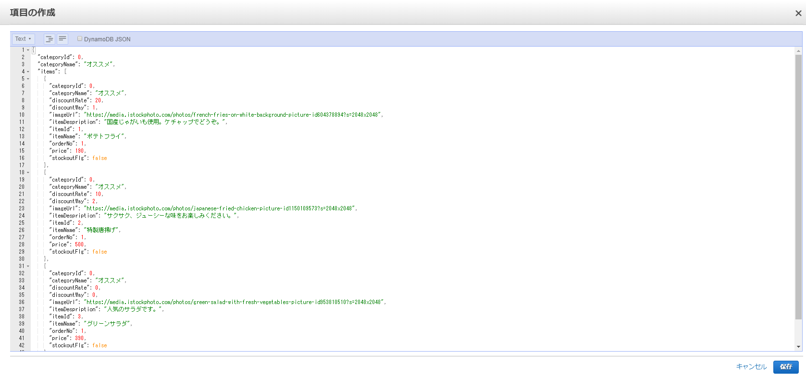

# テストデータの投入
- DynamoDB へテストデータの投入  
  本アプリの動作には店舗情報のデータを投入する必要があります。
  アプリデプロイ時に template.yaml の ItemListDBName に設定したテーブル名のテーブルに、テストデータを投入してください。
  テストデータはbackend -> APPフォルダ内、dynamodb_data/table_order_item_0.json ~ table_order_item_3.json, table_order_item_5.jsonの json 形式文字列です。
  AWSマネジメントコンソールの DynamoDB コンソールにて、ペーストして投入します。(※以下画像参照)  
  
  【テストデータの投入】
  

[次の頁へ](validation.md)

[目次へ戻る](../README.md)